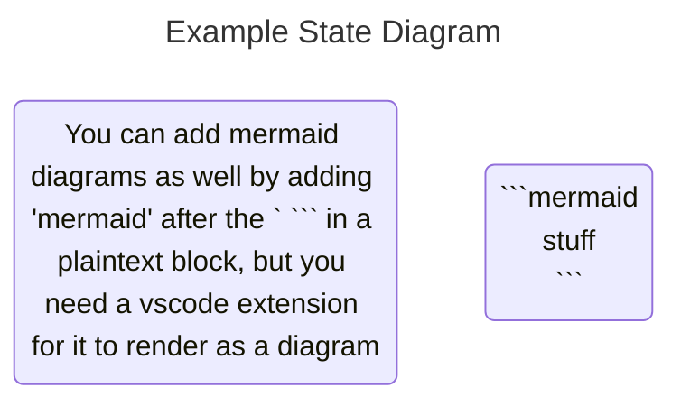

# Want to make your documentation and ***Discord/Slack messages*** pretty? Here's some basic MD formatting!

# why should you care?

MD is a great way to write well formatted documentation and messages quickly! Unlike html there aren't a bunch of tags you need to repeat all the time. A lot of the .md formatting may look familiar, and this is because **discord and slack allows most .md formatting rules to make messages look better**. Some features don't work on these platforms however, such as html drop in. 

# basic

Start with just text: plaintext / body

# headers

# \# gives header 1
## \#\# gives header 2
### Each hashtag you add makes it slightly smaller
-# to make subtitle: -#

# lists

* use '*' to add a list
1. you can also do this with a number followed by a period

# Text formatting

write the following for bold text:
```
**your text here**
```

which renders to:

**your text here**

similarly, with just one '*' on each side, you get italics:

*this is in italics*

You can have 3 of them for italics AND bold:

***this is both in italics and bolded***

You can use underscrolls (_) instead of '*':

_this is in italics_
__this is bolded__

<html>
    <body>
        <h2> Did you know most of the .md features are ways of writing html faster? In fact, you can just put in html and it renders! </h2>
    </body>
</html>

# plaintext blocks

```
use ``` content ``` to make it show as absolute text (ignore formatting)
This is useful for showing code.
```

```java
// you can show java code in md files, very useful for writing documentation
private double example = 1.;

// you can't run this code, but VSCode will display it with the same color coding as java code

/*
To write java code in md, use
"```java" followed by the content on the next line(s), closed with "```"
*/

```



# There are a lot of other great features, but these are the ones we mainly use in robotics. We recommend searching up other markdown rules to make your docs and messages look even nicer!
